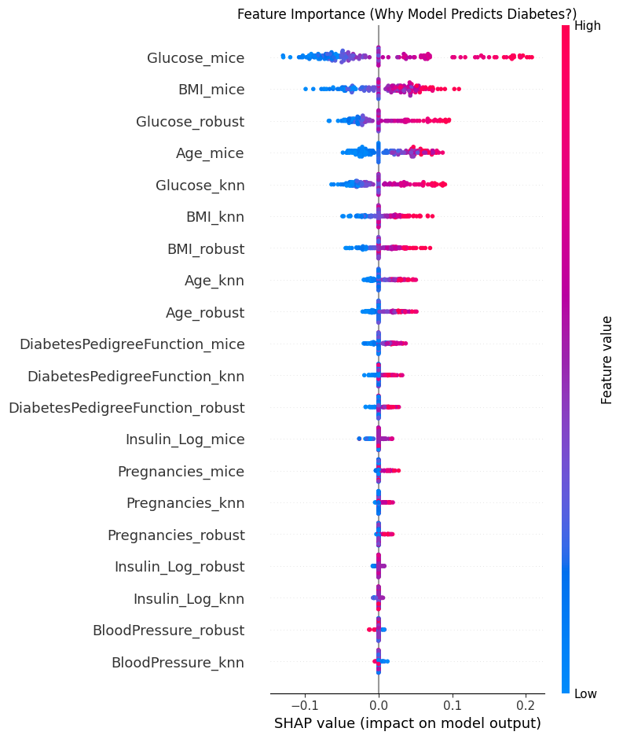

# 🏥 Bridging the Generalizability Gap in Diabetes Prediction
### **A Noise-Resilient Hybrid Imputation-Ensemble (NR-HIE) Framework**

[](https://github.com/hasnainalam596)
[](https://www.python.org/)
[](https://scikit-learn.org/)

> **"AI models shouldn't just predict; they must adapt to the messiness of real-world clinical data."**

---

## 📌 Project Overview
In medical diagnostics, **Missing Not At Random (MNAR)** data is a critical challenge. Standard AI models often fail when deployed in real-world settings because they learn from "clean" data but face "messy" patient records.

This project introduces the **NR-HIE Framework**, a novel architecture designed to bridge the "Generalizability Gap." By combining a **Triple-Stream Imputation** strategy with **Stacked Generalization**, we achieved robust performance on completely unseen external populations.

---

## 🚀 Key Features
| Feature | Description |
| :--- | :--- |
| **🧠 Hybrid Imputation** | A triple-stream approach combining **MICE** (Global correlations), **KNN** (Local clusters), and **Robust Statistics** (Outlier handling). |
| **⚙️ Stacking Ensemble** | A Meta-Learner utilizes predictions from **XGBoost**, **Random Forest**, and **Logistic Regression** to minimize variance. |
| **🌍 Generalizability** | Validated on an external **Bangladeshi Cohort (DiaBD)**, achieving an accuracy surge instead of a drop. |
| **🔍 Explainable AI** | Integrated **SHAP (Shapley Additive exPlanations)** to provide transparent, biologically valid reasoning for every prediction. |

---

## 📊 Results: The "Generalizability Surge"
Most models degrade on external data. Ours improved.

| Metric | Baseline Model (Standard) | NR-HIE (Internal Test) | NR-HIE (External Validation) |
| :--- | :---: | :---: | :---: |
| **Accuracy** | 75.32% | **77.27%** | **81.62%** 🚀 |
| **Brier Score**| 0.1302 | **0.1273** (High Safety) | - |
| **ROC-AUC** | 0.74 | **0.83** | **0.76** |

> *The drop in F1-score on external data is attributed to a prevalence shift, yet the high ROC-AUC confirms the model's robust ranking ability.*

---

## 🛠️ Methodology & Architecture

### 1. The Triple-Stream Pipeline
Instead of relying on a single imputation method, we generate three "views" of the data:
1.  **MICE Stream:** Captures multivariate relationships.
2.  **KNN Stream:** Preserves local data structure.
3.  **Robust Stream:** Preserves the signal of "missingness."

### 2. Stacked Generalization
The Level-1 Meta-Learner (Logistic Regression with L2 Regularization) dynamically weights these streams based on their predictive reliability.


---

## 📉 Explainability (SHAP Analysis)
We verified that the model relies on medically relevant biomarkers rather than noise.
* **Top Predictors:** Glucose, BMI, Age (Biologically Valid).
* **Noise Features:** Skin Thickness (Low Impact).



---

## 📦 Installation & Usage

### Prerequisites
* Python 3.8+
* Jupyter Notebook

### Setup
1. **Clone the repository:**
   ```bash
   git clone [https://github.com/hasnainalam596/NR-HIE-Generalizable-Diabetes-Prediction-Framework.git](https://github.com/hasnainalam596/NR-HIE-Generalizable-Diabetes-Prediction-Framework.git)
2. **Install dependencies:**
pip install -r requirements.txt

3. **Run the Notebook:**
jupyter notebook notebooks/01_Diabetes_Prediction_NR_HIE.ipynb

## 📂 Project Structure

├── data/               # Datasets (Pima Indians & DiaBD)
├── notebooks/          # Source code for Preprocessing & Modeling
├── reports/            # Project Report (PDF) & Presentation (PPTX)
├── images/             # Visualizations for README
├── requirements.txt    # Python dependencies
└── README.md           # Project Documentation

## 📜 Future Roadmap

**Demographic Expansion:** Retrain on male datasets to mitigate gender bias.

**Longitudinal Analysis:** Integrate LSTMs for time-series risk forecasting.

**Deployment:** Develop a Streamlit/Flask web app for doctors.

## 🤝 Contact & Contribution

### Hasnain Alam

Role: Data Scientist & Researcher

GitHub: @hasnainalam596

Email: alamhasnain457@gmail.com

If you find this research useful, please star ⭐ this repository!
